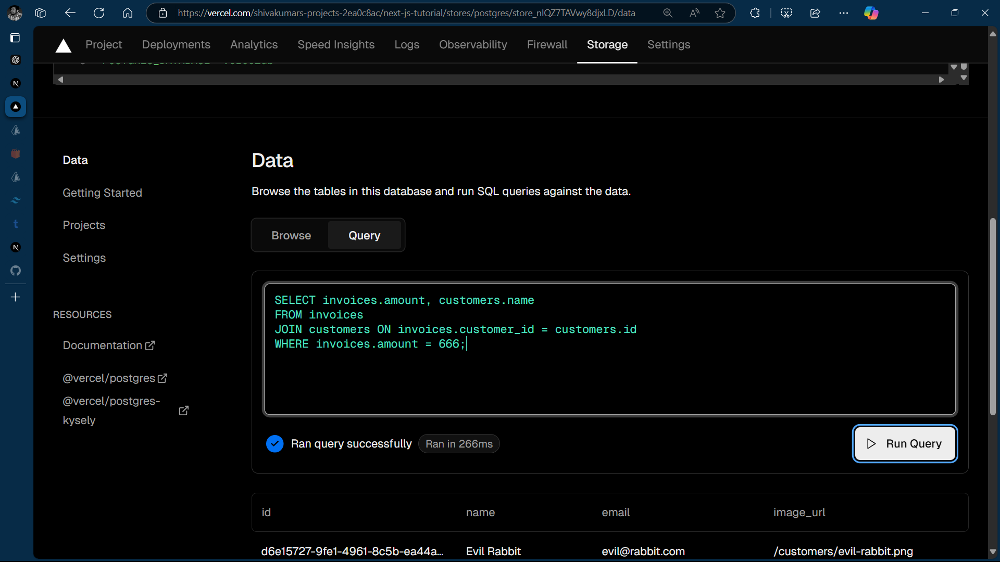

## Next.js App Router Course - All lessons Included 

I have faced many problems while completing the Next JS [lessons](https://nextjs.org/learn/dashboard-app/css-styling) , So I have created this repository which has a commit of every lesson 

I know most of you will not have a problem until lesson 5, The only problem might be lesson 6, I initially gave up on that too and started to setup a local database using prisma and sqlite 

If you are unable to move past lesson 6 use the file `SQL_Script.sql` 
 and paste it in run query mode in vercel postgres instance, This will create a database with manual code and you can skip lesson 6 and move to the next one if this doesn't work and you still have problem I would suggest to delete that postgres instance completely and create a new one as your previous queries and uploads might cause conflicts 

Notes : 
1. Skipped lesson 10 because when I add that it is showing you should have latest next js version besides the documentation itself stating that it is still in experimental stage so I don't want to worry about that topic right now as most of the features are already working fine so skipping that lesson 10 
2. In lesson 11 the debounce method is not working for me because of react js version mis-match 
3. In lesson 13 uncomment this line " throw new Error("Failed to Delete Invoice"); " in "app/lib/actions.ts" and run it like it shows how error is shown 
4. Skipping lesson 14 cause it is only of improving accessability so I think I cannot spend more time on it now 
5. Lesson 15 this authentications works differently in production and local so check that once while uploading it in production 
6. lesson 16 since metadata is a straight forward lesson I am skipping that too 